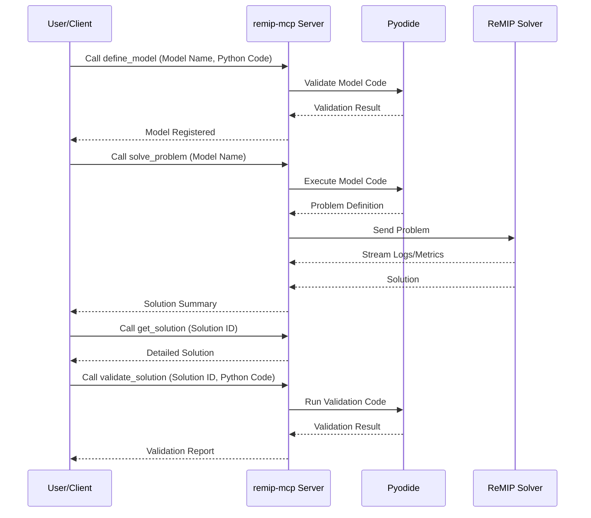

# ReMIP MCP Server

> 🚀 A powerful Model Context Protocol (MCP) server for solving Mixed-Integer Programming (MIP) problems with Pyodide and ReMIP.

[](https://github.com/ohtaman/remip-mcp/actions/workflows/ci.yml)

---

This project provides a service for modeling and solving Mixed-Integer Programming (MIP) problems. It is designed to be used as a tool within a larger system that follows the Model Context Protocol (MCP).

## 💡 What is this?

This is a server that gives you tools to solve complex optimization problems. You can define reusable optimization models using Python's `pulp` library, solve them with powerful MIP solvers, and validate the results. The server handles the complicated parts of setting up the problem, communicating with the solver, and managing your models and solutions.

It's useful for anyone who needs to solve resource allocation, scheduling, or other optimization tasks without wanting to build the entire solving pipeline themselves. The server supports model reuse, solution validation, and provides detailed progress updates during solving.

---

## ⚡ Quick Start

To get the `remip-mcp` server up and running quickly:

1.  **Clone the repository:** ⬇️
    ```bash
    git clone https://github.com/ohtaman/remip-mcp.git
    cd remip-mcp
    ```
2.  **Install dependencies:** 📦
    ```bash
    npm install
    ```
3.  **Start the development server:** ▶️
    ```bash
    npm run dev
    ```
    This will start the server with auto-reloading.

4.  **Start the ReMIP backend server (required):** ⚙️
    In a separate terminal, run:
    ```bash
    npm run remip-server
    ```
    The `remip-mcp` server requires a running ReMIP backend to solve problems.

## ✨ Core Features

This server provides seven main tools for a complete optimization workflow:

*   **`define_model`**: 📝 Defines a reusable optimization model template using Python's `pulp` library. Models can be saved and reused across multiple solving sessions.
*   **`solve_problem`**: ⚙️ Executes an optimization using a pre-defined model. It streams live updates, so you can see the solver's progress in real-time.
*   **`get_solution`**: 📊 Retrieves detailed solution information including variable values, objective value, and solver statistics.
*   **`validate_solution`**: ✅ Validates a solution against problem constraints using custom Python validation code.
*   **`list_models`**: 📋 Lists all registered models in the current session with their metadata.
*   **`get_model`**: 🔍 Retrieves the source code and details of a specific registered model.
*   **`list_solutions`**: 📈 Lists summaries of all solutions generated in the current session.

## 🧠 How It Works

The server is built with Node.js and uses a technology called **Pyodide** to safely run your Python code without you needing to install Python yourself.



Here's a step-by-step breakdown of the process:

1.  You call the `define_model` tool with your optimization model written in Python and a model name.
2.  The server validates your code and stores the model for reuse.
3.  You call the `solve_problem` tool with the model name to execute the optimization.
4.  The server runs your model code, creates a problem definition, and sends it to a **ReMIP (Remote MIP) solver**.
5.  As the solver works, it sends back logs and progress metrics, which you receive as notifications.
6.  Once finished, you get a solution summary with a unique solution ID.
7.  You can use `get_solution` to retrieve detailed solution information.
8.  You can use `validate_solution` to run custom validation code against the solution.
9.  Models and solutions are managed per session and can be listed using `list_models` and `list_solutions`.

## 🔌 Client Interaction and Command Line Arguments

This `remip-mcp` server exposes its tools via the Model Context Protocol. Clients can connect to this server to utilize its MIP solving capabilities. While the exact connection mechanism depends on the client application, a client might use a configuration similar to the following to define how it connects to and manages this server:

```json
{
  "mcpServers": {
    "remip-mcp": {
      "command": "npx",
      "args": [
        "-y",
        "github:ohtaman/remip-mcp",
        "--start-remip-server"
      ]
    }
  }
}
```

*Note: This JSON is an example of a client-side configuration and is not processed by this `remip-mcp` server directly. It illustrates how a client might define the command to launch or manage this server.*

### Command Line Arguments

The `remip-mcp` server can be configured using the following command-line arguments when run directly (e.g., via `node dist/index.js` or `npx ...`).

*   **`--http`** (boolean)
    *   Enables the HTTP transport for the MCP server. When enabled, the server will listen for MCP requests over HTTP.
    *   Default: `false`
*   **`--port <number>`** (number)
    *   Specifies the port for the HTTP transport. This argument is only relevant when `--http` is enabled.
    *   Default: `8080`
*   **`--start-remip-server`** (boolean)
    *   If set, the `remip-mcp` server will attempt to start a local ReMIP backend server as a child process.
    *   Default: `false`
*   **`--remip-source-uri <string>`** (string)
    *   Specifies the source URI for the ReMIP server to be started. This is used when `--start-remip-server` is true.
    *   Default: `github:ohtaman/remip-server`
*   **`--remip-host <string>`** (string)
    *   Specifies the host of the ReMIP server that `remip-mcp` should connect to.
    *   Default: `localhost`
*   **`--remip-port <number>`** (number)
    *   Specifies the port of the ReMIP server that `remip-mcp` should connect to.
    *   Default: `8081`
*   **`--pyodide-packages <string[]>`** (array of strings)
    *   Provides a comma-separated list of additional Pyodide packages (e.g., `numpy,pandas`) to be installed and available in the Pyodide environment.
    *   Default: `[]`

**Example Usage:**

To start the `remip-mcp` server with HTTP transport on port 9000 and also start a local ReMIP server:

```bash
node dist/index.js --http --port 9000 --start-remip-server
```

To connect to an existing ReMIP server at `my-remip-host:8000` and enable HTTP transport:

```bash
node dist/index.js --http --remip-host my-remip-host --remip-port 8000
```

---

## 💻 Interacting with the Server via CLI

This server exposes its capabilities through specific tools that can be invoked by any MCP-compatible client, including conceptual CLI clients. Below are the tools, their expected arguments, and any important considerations or limitations.

### Tool: `define_model` 📝

*   **Purpose**: Defines a reusable optimization model template using Python's `pulp` library.
*   **Arguments**: ✅
    *   `model_name` (string, **required**): The name of the model to define or update.
    *   `model_code` (string, **required**): Your Python code defining the PuLP model.
*   **Limitations**: ⚠️
    *   The Python code must use the `pulp` library.
    *   It must define exactly one `pulp.LpProblem` instance globally.
    *   You can use PuLP (model definition only), NumPy and Pandas.
*   **Conceptual CLI Example**:
    ```bash
    # Assuming 'mcp-cli' is your MCP client
    mcp-cli call define_model --model_name "my_optimization" --model_code "import pulp; prob = pulp.LpProblem('MyProblem', pulp.LpMaximize); x = pulp.LpVariable('x'); prob += x"
    ```

### Tool: `solve_problem` ⚙️

*   **Purpose**: Executes an optimization using a pre-defined model template.
*   **Arguments**: ✅
    *   `model_name` (string, **required**): The name of the pre-defined model template to use.
    *   `timeout` (number, **optional**): Timeout in seconds for the backend solver.
*   **Limitations**: ⚠️
    *   Requires a running ReMIP backend server.
    *   The `model_name` must correspond to a valid, existing model definition.
*   **Conceptual CLI Example**:
    ```bash
    mcp-cli call solve_problem --model_name "my_optimization" --timeout 300
    ```

### Tool: `get_solution` 📊

*   **Purpose**: Retrieves detailed solution information for a given solution ID.
*   **Arguments**: ✅
    *   `solution_id` (string, **required**): The ID of the solution to retrieve.
    *   `include_zero_variables` (boolean, **optional**): Whether to include variables with zero values (default: true).
*   **Conceptual CLI Example**:
    ```bash
    mcp-cli call get_solution --solution_id "sol-12345" --include_zero_variables false
    ```

### Tool: `validate_solution` ✅

*   **Purpose**: Validates a solution against problem constraints using custom Python validation code.
*   **Arguments**: ✅
    *   `solution_id` (string, **required**): The ID of the solution to validate.
    *   `validation_code` (string, **required**): Python script to process and validate the solution.
*   **Limitations**: ⚠️
    *   The solution object is available as a global dictionary named 'solution'.
    *   The validation code must be self-contained and rebuild necessary data for unbiased checking.
*   **Conceptual CLI Example**:
    ```bash
    mcp-cli call validate_solution --solution_id "sol-12345" --validation_code "print('Solution validated!')"
    ```

### Tool: `list_models` 📋

*   **Purpose**: Lists all registered models in the current session with their metadata.
*   **Arguments**: ✅ None required.
*   **Conceptual CLI Example**:
    ```bash
    mcp-cli call list_models
    ```

### Tool: `get_model` 🔍

*   **Purpose**: Retrieves the source code and details of a specific registered model.
*   **Arguments**: ✅
    *   `model_name` (string, **required**): The name of the model to retrieve.
*   **Conceptual CLI Example**:
    ```bash
    mcp-cli call get_model --model_name "my_optimization"
    ```

### Tool: `list_solutions` 📈

*   **Purpose**: Lists summaries of all solutions generated in the current session.
*   **Arguments**: ✅ None required.
*   **Conceptual CLI Example**:
    ```bash
    mcp-cli call list_solutions
    ```

---

## 👨‍💻 For Developers

This section contains information for developers who want to contribute to or run this project locally.

### Building and Running 🛠️

**Prerequisites:**
*   Node.js
*   npm

**Installation:**
```bash
npm install
```

**Linting and Formatting:**
```bash
# Run the linter
npm run lint

# Automatically fix linting and formatting issues
npm run lint:fix
```

**Running the development server:**
This command starts the server with auto-reloading when source files change.
```bash
npm run dev
```

**Running the production server:**
First, build the TypeScript code:
```bash
npm run build
```
Then, start the server:
```bash
npm start
```
*Note: The `start` script uses `ts-node` which is generally not recommended for production. For a true production environment, you would run the compiled javascript: `node dist/index.js`.*

**Running the ReMIP backend server:**
The project requires a running ReMIP server. You can start a local one using the following command:
```bash
npm run remip-server
```


## 📄 License

This project is licensed under the Apache-2.0 License - see the [LICENSE](LICENSE) file for details.


