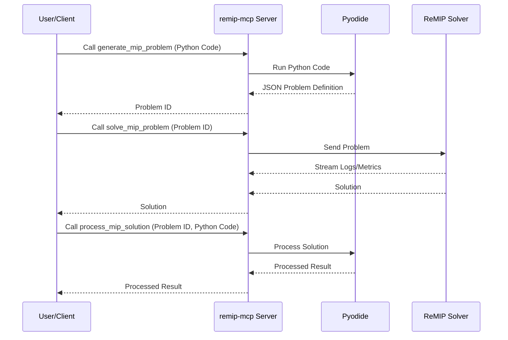

# ReMIP MCP Server

[](https://github.com/ohtamans/remip-mcp/actions/workflows/ci.yml)

This project provides a service for modeling and solving Mixed-Integer Programming (MIP) problems. It is designed to be used as a tool within a larger system that follows the Model Context Protocol (MCP).

## What is this?

This is a server that gives you tools to solve complex optimization problems. You can define your problem using Python's `pulp` library, send it to the server, and get a solution back. The server handles the complicated parts of setting up the problem and communicating with the solver.

It's useful for anyone who needs to solve resource allocation, scheduling, or other optimization tasks without wanting to build the entire solving pipeline themselves.

## Core Features

This server provides three main tools:

*   **`generate_mip_problem`**: Takes your Python code (using the `pulp` library) and transforms it into a JSON problem definition. This is the first step to solving your problem.
*   **`solve_mip_problem`**: Takes the problem file generated in the previous step and sends it to a powerful MIP solver. It streams live updates, so you can see the solver's progress in real-time.
*   **`process_mip_solution`**: Once you have a solution, this tool lets you run another Python script to validate, analyze, or format the results into a more human-readable format.

## How It Works

The server is built with Node.js and uses a technology called **Pyodide** to safely run your Python code without you needing to install Python yourself.



Here's a step-by-step breakdown of the process:

1.  You call the `generate_mip_problem` tool with your optimization model written in Python.
2.  The server runs your code and creates a JSON problem definition.
3.  You then pass this file to the `solve_mip_problem` tool.
4.  The server sends the problem to a **ReMIP (Remote MIP) solver**.
5.  As the solver works, it sends back logs and progress metrics, which you receive as notifications.
6.  Once finished, you get the final solution.
7.  You can then use `process_mip_solution` to work with the results.

### Client Connection Example (Conceptual)

This `remip-mcp` server exposes its tools via the Model Context Protocol. Clients can connect to this server to utilize its MIP solving capabilities. While the exact connection mechanism depends on the client application, a client might use a configuration similar to the following to define how it connects to and manages this server:

```json
{
  "mcpServers": {
    "remip-mcp": {
      "command": "npx",
      "args": [
        "-y",
        "github:ohtaman/remip-mcp",
        "--start-remip-server"
      ]
    }
  }
}
```

*Note: This JSON is an example of a client-side configuration and is not processed by this `remip-mcp` server directly. It illustrates how a client might define the command to launch or manage this server.*

---

## Interacting with the Server via CLI

This server exposes its capabilities through specific tools that can be invoked by any MCP-compatible client, including conceptual CLI clients. Below are the tools, their expected arguments, and any important considerations or limitations.

### Tool: `generate_mip_problem`

*   **Purpose**: Converts user-provided Python code (using the `pulp` library) into a problem definition that can be solved.
*   **Arguments**:
    *   `problemDefinitionCode` (string, **required**): Your Python code defining the MIP problem.
*   **Limitations**:
    *   The Python code must use the `pulp` library.
    *   It must define exactly one `pulp.LpProblem` instance.
    *   Standard Python syntax and `pulp` conventions apply.
*   **Conceptual CLI Example**:
    ```bash
    # Assuming 'mcp-cli' is your MCP client
    mcp-cli call generate_mip_problem --problemDefinitionCode "import pulp; prob = pulp.LpProblem('MyProblem', pulp.LpMaximize); x = pulp.LpVariable('x'); prob += x"
    ```

### Tool: `solve_mip_problem`

*   **Purpose**: Solves a previously generated MIP problem using a ReMIP solver.
*   **Arguments**:
    *   `problemId` (string, **required**): The ID of the problem generated by `generate_mip_problem`.
*   **Limitations**:
    *   Requires a running ReMIP backend server.
    *   The `problemId` must correspond to a valid, existing problem definition on the server.
*   **Conceptual CLI Example**:
    ```bash
    mcp-cli call solve_mip_problem --problemId "your-problem-id-here"
    ```

### Tool: `process_mip_solution`

*   **Purpose**: Processes the solution of a solved MIP problem using user-provided Python code.
*   **Arguments**:
    *   `problemId` (string, **required**): The ID of the solved problem.
    *   `solutionProcessingCode` (string, **required**): Your Python code to process the solution.
*   **Limitations**:
    *   The `problemId` must correspond to a valid, *solved* problem.
    *   The Python code will have access to the solution data.
*   **Conceptual CLI Example**:
    ```bash
    mcp-cli call process_mip_solution --problemId "your-problem-id-here" --solutionProcessingCode "print('Solution processed!')"
    ```

---

## For Developers

This section contains information for developers who want to contribute to or run this project locally.

### Building and Running

**Prerequisites:**
*   Node.js
*   npm

**Installation:**
```bash
npm install
```

**Linting and Formatting:**
```bash
# Run the linter
npm run lint

# Automatically fix linting and formatting issues
npm run lint:fix
```

**Running the development server:**
This command starts the server with auto-reloading when source files change.
```bash
npm run dev
```

**Running the production server:**
First, build the TypeScript code:
```bash
npm run build
```
Then, start the server:
```bash
npm start
```
*Note: The `start` script uses `ts-node` which is generally not recommended for production. For a true production environment, you would run the compiled javascript: `node dist/index.js`.*

**Running the ReMIP backend server:**
The project requires a running ReMIP server. You can start a local one using the following command:
```bash
npm run remip-server
```


### Development Conventions

*   **Coding Style:** The project uses TypeScript, ESLint, and Prettier to enforce a consistent coding style. A pre-commit hook is set up with Husky to automatically format and lint your code before you commit.
*   **Testing:** The project uses Jest for testing. You can run the tests with `npm test`.
*   **Directory Structure:**
    *   `src/`: Contains the main source code.
    *   `src/schemas/`: Defines the data schemas for inputs and outputs.
    *   `src/connectors/`: Contains client code for interacting with external services like the ReMIP solver.
*   **Commits:** No explicit commit message convention is specified.
